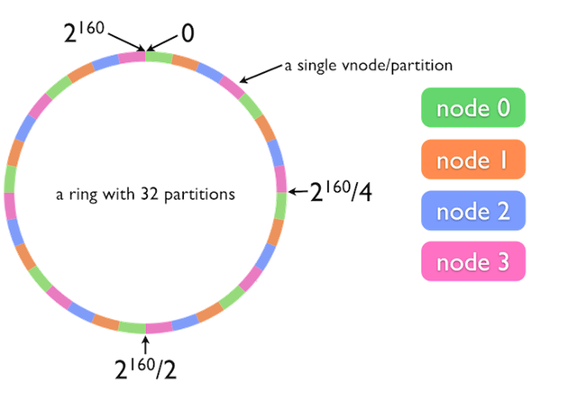

# [Riak TS](README.md) - How Partition Keys Work

Riak TS is designed to scale to handle massive data sets and high volumes of read and write operations (1,000,000+ IOPs with the right number and type of hardware or virtual hosts for your specific use case). Riak TS achieves this scalability by being able to seamlessly distribute its data and workloads across many individual nodes in a cluster. Of course if data is distributed across many machines than the database needs to know how to address (or find) the data for reads and writes. In this section we are going to describe how Riak TS partitions data and how this influences the selection of partition keys.


## Partitions

Riak TS divides its dataset into partitions (which are managed by **Virtual Nodes**: http://docs.basho.com/riak/kv/2.1.4/learn/concepts/vnodes/). By default Riak TS has 64 partitions however this number is configurable and can range from a minimum of 8 partitions up to a maximum 1024 (in powers of 2 e.g.: 8, 16, 32, 64, 128, 256, 512, and 1024). The number of partitions is specified in the ``` riak.conf ``` file in Riak TS's ``` etc ``` directory. The following lines from the ``` riak.conf ``` contain the ``` ring_size ``` parameter and basic information about setting the parameter:

```
## Number of partitions in the cluster (only valid when first
## creating the cluster). Must be a power of 2, minimum 8 and maximum
## 1024.
## 
## Default: 64
## 
## Acceptable values:
##   - an integer
## ring_size = 64
```

When first installed the ``` ring_size ``` parameter is commented out and the value defaults to 64. To set the value uncomment the parameter and update its value appropriately.

**Warning**: The ring size needs to be set in each node's ``` riak.conf ``` and I recommend setting it before you start the node for the first time. If you need to change the ring size after you have started a node (or more than one node) check out the following documentation on how to do it safely: http://docs.basho.com/riak/kv/2.2.0/configuring/basic/#ring-size.

If you have a single Riak TS node all of the partitions will live on that single node. If you have a cluster of Riak TS nodes than the partitions are distributed equally around the cluster. For example, if you have 8 nodes and 64 partitions then each node will have 8 partitions.

**Important Note:** The number of partitions has a direct impact on the scalability and performance of your cluster. Before setting up a production cluster please review the ring size planning guidance found here: http://docs.basho.com/riak/kv/2.1.4/setup/planning/cluster-capacity/#ring-size-number-of-partitions.


## The Ring

In order to write data to partitions in Riak TS those partitions need to have addresses. Riak TS's "Ring" is a 160-bit integer address space. This means that each Riak TS cluster can have:

``` 2^160 ```

or

``` 1,461,501,637,330,902,918,203,684,832,716,283,019,655,932,542,976 ```

 keys (which is a lot of keys).

 Each partition has a range of keys assigned to it equal to ``` 2^160 / N ``` where N is equal to the number of partitions in the cluster (or the ring size).


The following graphic provides a simplified illustration of how Riak TS assigns key ranges to partitions and partitions to nodes.



In the above example we have 32 partitions (instead of the default 64) distributed across 4 nodes. 

When you create a Riak TS cluster you "join" two or more independent nodes together using the ``` riak-admin cluster join ``` command. The second step of the process uses the ``` riak-admin cluster plan ``` command to calculate how to distribute the partitions around the nodes. The ``` plan ``` command outputs the results of its calculations when completed which will look like the following example:

```
=============================== Staged Changes ================================
Action         Nodes(s)
-------------------------------------------------------------------------------
join           'riak@192.168.2.2'
join           'riak@192.168.2.2'
join           'riak@192.168.2.2'
join           'riak@192.168.2.2'
-------------------------------------------------------------------------------


NOTE: Applying these changes will result in 1 cluster transition

###############################################################################
                         After cluster transition 1/1
###############################################################################

================================= Membership ==================================
Status     Ring    Pending    Node
-------------------------------------------------------------------------------
valid     100.0%     20.3%    'riak@192.168.2.2'
valid       0.0%     20.3%    'riak@192.168.2.3'
valid       0.0%     20.3%    'riak@192.168.2.4'
valid       0.0%     20.3%    'riak@192.168.2.5'
valid       0.0%     18.8%    'riak@192.168.2.6'
-------------------------------------------------------------------------------
Valid:5 / Leaving:0 / Exiting:0 / Joining:0 / Down:0

Transfers resulting from cluster changes: 51
  12 transfers from 'riak@192.168.2.2' to 'riak@192.168.2.3'
  13 transfers from 'riak@192.168.2.2' to 'riak@192.168.2.4'
  13 transfers from 'riak@192.168.2.2' to 'riak@192.168.2.5'
  13 transfers from 'riak@192.168.2.2' to 'riak@192.168.2.6'
```

The final step in creating the cluster is to run the ``` riak-admin cluster commit ``` command. Once the  ``` commit ``` command is executed Riak TS will begin the process of moving each partition to its assigned node.

**Note**: See the following documentation for a more complete introduction to creating a cluster: http://docs.basho.com/riak/kv/2.2.0/using/running-a-cluster/.


## Consistent Hashing

How does Riak TS know which partition a key/value pair should be written too or read from? It's quite simple really. Riak TS uses a consistent hashing (https://en.wikipedia.org/wiki/Consistent_hashing) function based on the SHA-1 algorithm (https://en.wikipedia.org/wiki/SHA-1) to convert the table name and key concatenated together into a number. Since every node in a Riak TS cluster has an updated copy of "the ring" (kept updated via gossip protocol) every node in the cluster is capable of serving reads and writes using this simple consistent hashing mechanism.

It is important to note that the consistent hashing mechanism that Riak TS (and KV) uses is designed to ensure an even distribution of data around your cluster. While you might expect that if you were to hash the letters of the alphabet (a, b, c, d, e, etc.) that the numeric output would be linear in fashion (example: 1, 2, 3, 4, 5, etc.) the opposite is actually true. To the casual observer the output of the hashing function would appear to be random in distribution (example: 1231014356, 3, 651231246633, 90123, 89923423112300012, etc.). 

While this even distribution of data around the cluster is ideal for hardware utilization it is not ideal for use cases where you want to perform range queries. In the next section, [The Partition Key](#the-partition-key), we are going to discuss how Riak TS uses the partition key to enable colocation of data on partitions in support of range queries.


## The Partition Key

Now that we understand how data is partitioned and addressed in Riak TS let's return to the primary key, or more specifically the partition portion of the primary key. In the previous section [Data Modeling Basics](Data Modeling Basics.md) we used the following primary key for the ``` WeatherStationData ``` table that we created:


```
	PRIMARY KEY (
		(StationId, QUANTUM(ReadingTimeStamp, 1, 'd') ),
		 StationId, ReadingTimeStamp
	)
```

In this example the partition portion of the key consists of the following:

```
(StationId, QUANTUM(ReadingTimeStamp, 1, 'd') )
```

As we learned previously Riak TS is using a consistent hashing function to turn the the table name and key into a number in order to assign it to a partition. In the standard model for hashing keys (used by Riak KV and TS if you don't use a quantum function for your partition key) we would just concatenate the table name (bucket) and the two parts of the partition key (the StationId and ReadingTimeStamp columns) together and hash the resulting value into our number. However, when we use a quantum function in our partition key (e.g. ``` QUANTUM(ReadingTimeStamp, 1, 'd') ```), Riak TS behaves very differently.

When you specify a partition key with a quantum function you are telling Riak TS that you want to colocate every record written for a specific range of time (one day in our current example) on a single partition. The boundaries for the quanta are calculated by Riak TS based on the start of the Unix Epoch: Jan 1, 1970 00:00:00 (If you are interested in the exact function that Riak TS uses to mark quanta you can view the code online here: https://github.com/basho/riak_ql/blob/develop/src/riak_ql_quanta.erl#L91). Every record written that falls within the boundaries of a quantum will have its partition key hash to the same value, e.g.:


* Key = ```{'Station-1001', '2016-07-22 12:22:57'}```
* Key = ```{'Station-1001', '2016-07-22 12:24:57'}```
* Key = ```{'Station-1001', '2016-07-22 12:30:00'}```

Will all hash to the same value and be stored on the same partition. The following key however hashes to a different quantum since the date/timestamp falls on the next day:

* Key = ```{'Station-1001', '2016-07-23 2:53:20'}```

**Note**: Riak TS stores dates as UTC and converts from your cluster's local time zone when saving a record.

When selecting a quantum to use for your partition key it is important to keep in mind that there are tradeoffs associated with the size of the quantum. There are two primary competing goals for choosing a quantum:

1. Utilize your cluster's hardware efficiently by distributing the data evenly around the cluster (both in terms of storage and performance since focusing all of your reads and writes on a single node limits read and write throughput for the cluster);

1. Colocate data close together to improve query performance.

Small quanta favor writes in terms of performance and storage while larger quanta favor querying. Selecting the right quantum for your partition key is often the most challenging piece of the data modeling process.

The final important note to make about quanta is how they affect querying of data. When the database executes a ```SELECT``` statement that covers more than one quantum a sub-query is created for each quantum. By default Riak TS limits queries to a maximum span of 5 quanta in order to protect the cluster from being overloaded by queries attempting to retrieve too much data. If a query spans more than 5 quanta the database will return an error. The following ``` SELECT ``` example queries records across the entire month of July 2016 (when our table's quantum is set to 1 day) and will return an error when run:

``` 
SELECT * FROM WeatherStationData WHERE StationId = 'Station-1001' AND ReadingTimeStamp >= '2016-07-01 00:00:00' AND ReadingTimeStamp <= '2016-08-01 00:00:00'; 
```

When executed in the riak-shell application you should see the following error message:

``` Error (1001): Too many subqueries (32) ```

Notice that the number of quanta that the query would span is included in the error message, e.g.: ``` (32) ```.

If you are really curious you can use the ``` EXPLAIN ``` statement in riak-shell to see details on how Riak TS executes the query above:

```
EXPLAIN SELECT * FROM WeatherStationData WHERE StationId = 'Station-1001' AND ReadingTimeStamp >= '2016-07-01 00:00:00' AND ReadingTimeStamp <= '2016-08-01 00:00:00';
```

and Riak will return the following output (truncated here to save some space):

```
+--------+-------------------------------------------------------+------------------------------------------------------------+-------------------+------------------------------------------------------------+-----------------+------+
|Subquery|                     Coverage Plan                     |                    Range Scan Start Key                    |Is Start Inclusive?|                     Range Scan End Key                     |Is End Inclusive?|Filter|
+--------+-------------------------------------------------------+------------------------------------------------------------+-------------------+------------------------------------------------------------+-----------------+------+
|   1    |riak@127.0.0.1/61, riak@127.0.0.1/62, riak@127.0.0.1/63|StationId = 'Station-1001', ReadingTimeStamp = 1467331200000|       false       |StationId = 'Station-1001', ReadingTimeStamp = 1467417600000|      false      |      |
|   2    |riak@127.0.0.1/39, riak@127.0.0.1/40, riak@127.0.0.1/41|StationId = 'Station-1001', ReadingTimeStamp = 1467417600000|       false       |StationId = 'Station-1001', ReadingTimeStamp = 1467504000000|      false      |      |
|   3    | riak@127.0.0.1/10, riak@127.0.0.1/8, riak@127.0.0.1/9 |StationId = 'Station-1001', ReadingTimeStamp = 1467504000000|       false       |StationId = 'Station-1001', ReadingTimeStamp = 1467590400000|      false      |      |
|   4    |riak@127.0.0.1/18, riak@127.0.0.1/19, riak@127.0.0.1/20|StationId = 'Station-1001', ReadingTimeStamp = 1467590400000|       false       |StationId = 'Station-1001', ReadingTimeStamp = 1467676800000|      false      |      |
|   5    |riak@127.0.0.1/11, riak@127.0.0.1/12, riak@127.0.0.1/13|StationId = 'Station-1001', ReadingTimeStamp = 1467676800000|       false       |StationId = 'Station-1001', ReadingTimeStamp = 1467763200000|      false      |      |
|   6    |riak@127.0.0.1/24, riak@127.0.0.1/25, riak@127.0.0.1/26|StationId = 'Station-1001', ReadingTimeStamp = 1467763200000|       false       |StationId = 'Station-1001', ReadingTimeStamp = 1467849600000|      false      |      |
```


## Configuring The Quanta Span

The maximum quanta that can be spanned in a query can be configured in the ``` riak.conf ``` file by setting the ``` riak_kv.query.timeseries.max_quanta_span ``` parameter as shown below:

```
## Maximum number of quanta that a query can span. Larger quanta spans
## mean the time duration for a query can be bigger. This is constrained to
## prevent excessively long running queries that could affect the performance
## of the cluster.
## 
## Default: 5
## 
## Acceptable values:
##   - an integer
riak_kv.query.timeseries.max_quanta_span = 5
```

**Note**: The ``` riak_kv.query.timeseries.max_quanta_span ``` parameter replaced the ``` timeseries_query_max_quanta_span = 5 ``` parameter in Riak TS 1.4.

As noted in the comments above you should add one to the quanta that you plan on querying or else expect that some percentage of the data you are trying to query will fall outside of quanta span window.

**Warning**: Remember that the quanta span limit was put into place for a reason. Increasing the limit too much may result in negative impacts on the performance of your Riak TS cluster. 

**Note**: For more information about Riak TS specific configuration settings see the following documentation: http://docs.basho.com/riak/ts/latest/using/configuring/.

In the next section [Selecting A Partition Key](Selecting A Partition Key.md) we will go into more detail about how to select partition keys that make sense for specific types of use cases.

---

 **Previous**: [ Data Modeling Basics](Data Modeling Basics.md) | **Next**: [Selecting A Partition Key](Selecting A Partition Key.md)


